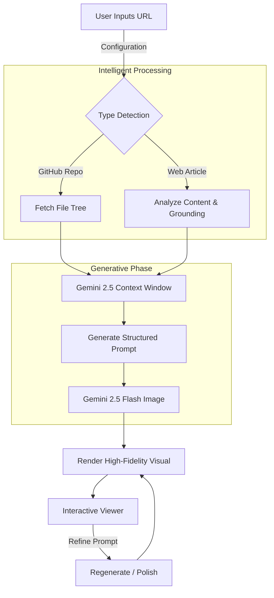

# Link2Ink Studio 🖋️✨

> **Visual Intelligence for Developers & Designers.**
> Transform code repositories and web articles into stunning, structured architectural blueprints and infographics instantly using Google Gemini 2.5.

  

---

## 🚀 Overview

**Link2Ink Studio** is a next-generation visualization platform. It bridges the gap between raw data (code, text) and visual understanding. By leveraging the multimodal capabilities of **Gemini 2.5 Flash** and **Gemini 2.5 Flash Image**, it generates high-fidelity diagrams, 3D holographic models, and educational infographics directly from simple URLs.

---

## ✨ Core Features

### 1. 🧬 Repository Analyzer (GitFlow)
Turn any public GitHub repository into a visual architecture diagram.
*   **Deep Tree Analysis**: Fetches and filters the file structure of any repo.
*   **Architectural Synthesis**: Gemini analyzes the tech stack (React, Python, Go, etc.) to understand data flow.
*   **2D & 3D Generation**: Generates standard flowcharts or photorealistic "tabletop" holographic models.
*   **Interactive Refinement**: Regenerate visuals with specific focus areas (e.g., "Focus on Auth").

### 2. 📰 SiteSketch (Article to Infographic)
Convert dense articles or documentation into digestible visual summaries.
*   **Content Extraction**: Reads and summarizes key takeaways from any URL.
*   **Visual Metaphor Matching**: Automatically selects the best visual layout (Timeline, Funnel, Comparison).
*   **Citation Grounding**: Verified links and sources provided alongside the graphic.
*   **Style Control**: Choose from "Neon Cyberpunk", "Modern Editorial", and more.

### 3. 🎨 Reality Engine (Image Editor)
*   **Style Transfer**: Redraw existing diagrams in new artistic styles.
*   **Refinement**: Use natural language to tweak and perfect generated visuals.

---

## 📸 Visual Workflow



---

## 🛠️ Tech Stack & Design

### Architecture
*   **Framework**: React 19
*   **Build Tool**: Vite
*   **AI Provider**: Google Gemini API (`@google/genai`)
*   **Visualization**: D3.js (Force Directed Graphs)

### "Afflicted AI" Design System
The UI follows a strict **Dark Mode** aesthetic inspired by futuristic SaaS interfaces.
*   **Background**: Deep slate/black (`#030303`) with generative noise and radial gradients.
*   **Glassmorphism**: Heavy use of `backdrop-blur-2xl` and semi-transparent borders (`border-white/5`).
*   **Typography**: `Inter` for UI, `JetBrains Mono` for data/code.
*   **Accents**: Violet (`#8b5cf6`) and Emerald (`#10b981`) neon glows.

---

## 📦 Installation

1.  **Clone the repository**
    ```bash
    git clone https://github.com/yourusername/link2ink.git
    ```

2.  **Install dependencies**
    ```bash
    npm install
    ```

3.  **Environment Setup**
    *   Ensure you have a **Google Cloud Project** enabled API Key with access to Gemini 2.5 models.
    *   The application handles key selection securely via the AI Studio integration.

4.  **Run Development Server**
    ```bash
    npm run dev
    ```

---

<p align="center">
  <span style="font-family: monospace; opacity: 0.7;">(c) 2025 AfflictedAI - We trying ok.....</span>
</p>
