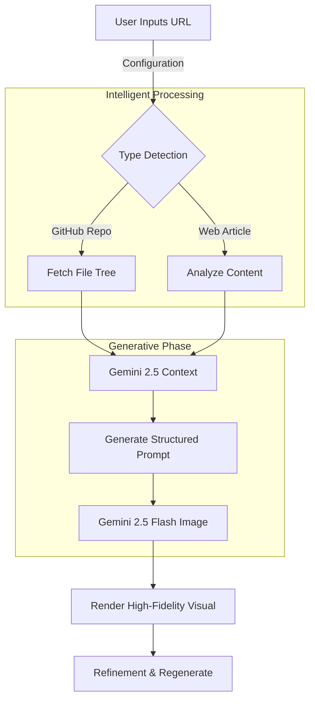

# Link2Ink Studio 🖋️

> **Visual Intelligence for Developers & Designers.**
> Transform code repositories and web articles into stunning, structured architectural blueprints and infographics instantly using Google Gemini 2.5.

  

---

## 🚀 Overview

**Link2Ink Studio** is a next-generation visualization platform. It bridges the gap between raw data (code, text) and visual understanding. By leveraging the multimodal capabilities of **Gemini 2.5 Flash** and **Gemini 2.5 Flash Image**, it generates high-fidelity diagrams, 3D holographic models, and educational infographics directly from simple URLs.

---

## ✨ Core Features

### 1. 🧬 Repository Analyzer (GitFlow)
Turn any public GitHub repository into a visual architecture diagram.
*   **Deep Tree Analysis**: Fetches and filters the file structure of any repo.
*   **Architectural Synthesis**: Gemini analyzes the tech stack to understand data flow.
*   **2D & 3D Generation**: Generates standard flowcharts or photorealistic "tabletop" holographic models.
*   **Interactive Refinement**: Regenerate visuals with specific focus areas.

### 2. 📰 SiteSketch (Article to Infographic)
Convert dense articles or documentation into digestible visual summaries.
*   **Content Extraction**: Reads and summarizes key takeaways from any URL.
*   **Visual Metaphor Matching**: Automatically selects the best visual layout.
*   **Style Control**: Choose from "Neon Cyberpunk", "Modern Editorial", and more.

---

## 📸 Visual Workflow



---

## 🛠️ Tech Stack & Design

### Architecture
*   **Framework**: React 19
*   **Build Tool**: Vite
*   **AI Provider**: Google Gemini API (`@google/genai`)
*   **Visualization**: D3.js

### Design System (Carbon / Zinc)
The UI follows a strict **Product Mockup** aesthetic.
*   **Background**: True Black (`#000000`)
*   **Surfaces**: Zinc-950 (`#09090b`) with sharp borders.
*   **Accents**: White (`#ffffff`) for high contrast actions.
*   **Typography**: `Inter` (UI) and `JetBrains Mono` (Data).

---

## 📦 Installation

1.  **Clone the repository**
    ```bash
    git clone https://github.com/yourusername/link2ink.git
    ```

2.  **Install dependencies**
    ```bash
    npm install
    ```

3.  **Run Development Server**
    ```bash
    npm run dev
    ```

---

<p align="center">
  <span style="font-family: monospace; opacity: 0.7;">(c) 2025 AfflictedAI - We trying ok.....</span>
</p>
